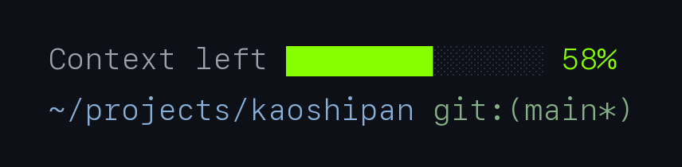
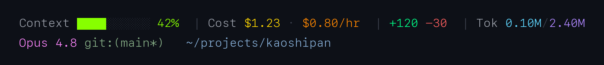

# CC-statusline-kit

A **two-line status line for [Claude Code](https://claude.com/claude-code)** built around one idea: a status line should make you *calmer*, not busier.

Most status lines compete on density — powerline themes, cost projections, cache-hit ratios, a dozen widgets fighting for your eyes. The more they show, the more you have to *scan*, and scanning a wall of numbers for the one you care about is exactly what fuels that low-grade "am I about to run out / where am I again?" anxiety.

This kit ships two modes. The default **Calm mode** answers only the two questions that actually nag at you:

> **「还能聊多久?」** — how much context budget is left
> **「我在哪?」** — which directory (and branch) this window is in



That's it. A budget bar that turns **green → gold → red** as room runs out, and your location. Nothing to scan.

## The two modes

| Mode | File | Shows | For |
|---|---|---|---|
| **Calm** (default) | `scripts/statusline.sh` | Context-left bar + directory | Staying focused, fighting dashboard anxiety |
| **Full** | `scripts/statusline-full.sh` | Context · cost · churn · tokens + model · git · path | When you genuinely want every metric |

### Calm mode — the two vitals

**Line 1 · 余量 (how much longer)**
- `Context left ██████░░ 58%` — context budget **remaining** (not used). Bar color is a traffic light:
  - 🟢 **green** > 50% left — breathe easy
  - 🟡 **gold** 20–50% — start wrapping up
  - 🔴 **red** < 20% — compaction is near

**Line 2 · 坐标 (where you are)**
- `~/projects/xxx` — current folder, `$HOME` shortened to `~`
- `git:(main*)` — branch, `*` means uncommitted changes

### Full mode — the dashboard



Line 1 metrics: `Context` · `Cost $ · $/hr` · `+added -removed` · `Tok window/session`.
Line 2 identity: `Model` · `git:(branch*)` · `~/path`. Every value gets its own hue.

## Install

Calm mode (default):
```bash
cp scripts/statusline.sh ~/.claude/statusline.sh
chmod +x ~/.claude/statusline.sh
```

Prefer the full dashboard? Use `scripts/statusline-full.sh` instead.

Then register it in `~/.claude/settings.json`:
```json
{ "statusLine": { "type": "command", "command": "~/.claude/statusline.sh" } }
```

Reopen a Claude Code session to see it.

**Dependencies:** `jq` (required). Full mode also uses `python3` (session-cumulative tokens) and optionally `ccusage` (burn rate). Calm mode needs only `jq`.

## Customize colors

Both scripts define their palette as 256-color ANSI codes (`\033[38;5;<N>m`, N = 0–255) near the top. In calm mode, `C_OK` / `C_WARN` / `C_LOW` are the three budget colors, and the 50% / 20% thresholds live in the `if [ $left_pct ... ]` block.

## Generating the preview images

This repo renders previews with **Pillow** (`scripts/_render*.py`), not a headless browser — headless Chrome/Edge proved flaky on macOS. Run `python3 scripts/_render_calm.py` to regenerate `preview-calm.png`.

## As a Claude Code skill

Drop the folder into `~/.claude/skills/statusline-kit/` and Claude Code can install, switch modes, recolor, or explain the status line on request. See `SKILL.md`.

## License

MIT
